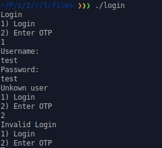
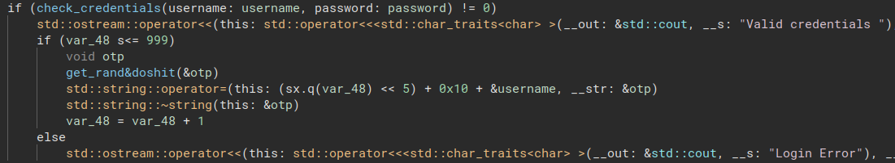
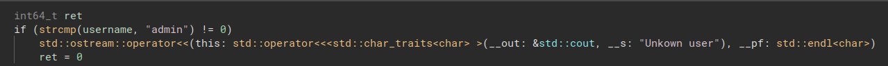
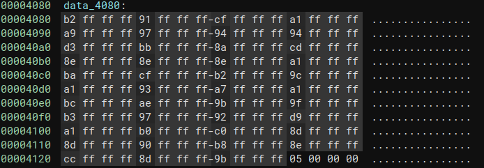
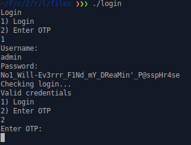
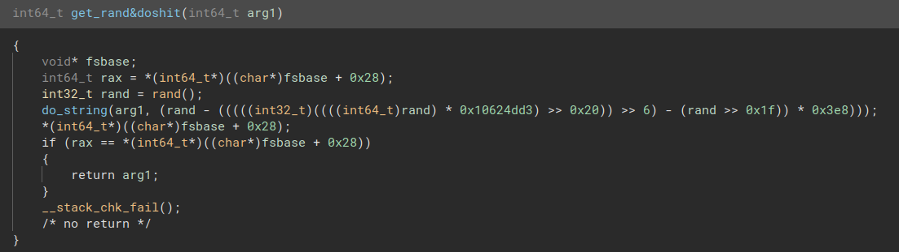
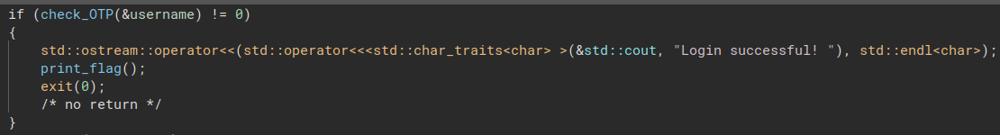
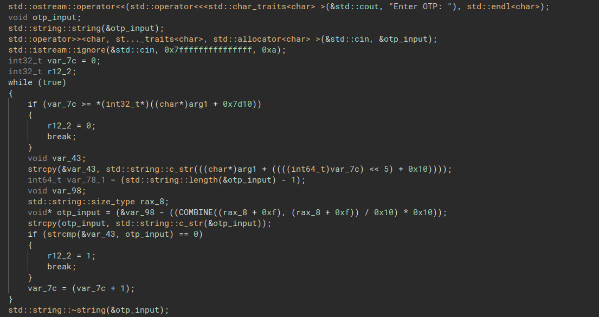
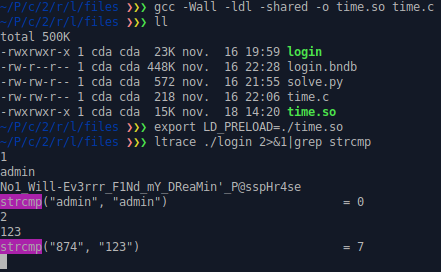

Nice reverse challenge, don't know if this was the intendeed solution ¯\\\_(ツ)_/¯

# Login
## First run

Provided file is stripped x86_64 binary.
```bash
$ file login
login: ELF 64-bit LSB pie executable, x86-64, version 1 (SYSV), dynamically linked, interpreter /lib64/ld-linux-x86-64.so.2, BuildID[sha1]=4abb8e2e1f0dfd82e4b0e6d129e6f257eb5d8228, for GNU/Linux 4.4.0, stripped
```




The programm is asking for login and password, and it seems to ask for OTP after valid authentication. 
Let's open it in Binary Ninja

## Reversing

Okay so it's a C++ binary, luckily for us, Binary Ninja is pretty cool with C++ :)
### Login and Password
We can identify the "check_creds" routine: 

Username is ..... admin ^^

The password check is fun :D
```C
if (password_len != 43)
{
	std::ostream::operator<<(std::operator<<<std::char_traits<char> >(&std::cout, "Wrong password"), std::endl<char>);
	ret = 0;
}
else
{
	for (int32_t ctr = 0; ctr < password_len; ctr = (ctr + 1))
	{
		sleep(((*(int32_t*)((((int64_t)ctr) << 2) + &data_4080) + ((int32_t)password[((int64_t)ctr)])) * 0x64));
	}
	ret = 1;
}
```
In fact any password is valid :D but it could take a lot of time to execute ^^

The for loop iterate over input characters and to some operation with const data. This operation restults as int32 and is used as arg for sleep(3).
Let's have a look at the const data: 




So it will take each 4bytes of this const, and add it to our input char * 0x64, and then cast it as a signed int. This sounds good :D we can now calculate each password char to get 0 (thanks to the cast) as result and avoid each sleep in the loop. 

```python
>>> for i in range(43):
... password.append(0x100000000-int.from_bytes(bv.read(0x4080+i*4,4),"little"))
>>> password
[78, 111, 49, 95, 87, 105, 108, 108, 45, 69, 118, 51, 114, 114, 114, 95, 70, 49, 78, 100, 95, 109, 89, 95, 68, 82, 101, 97, 77, 105, 110, 39, 95, 80, 64, 115, 115, 112, 72, 114, 52, 115, 101]
>>> ''.join(chr(x) for x in password)
"No1_Will-Ev3rrr_F1Nd_mY_DReaMin'_P@sspHr4se"
```

Running the binary with good username and password gets us to the OTP input: 



Let's reverse the OTP generation

### OTP
It seems to be generated using rand(), then some dark magic math:


Then, the check function is called with username as arg:

There is also some dark magic in this function: 


We also notice that the rand is init with a predictible seed in main:
```C
srand(time(nullptr));
```

At this time, we have 3 ways to solve :D
- Recode all the OTP generation at run and send it (so long)
- Pure bruteforce the OTP (send the same until a wild flag appears)
- Generate an OTP in the future (That's a great idea Marty!!)

I used the 3rd method. I used the LD_PRELOAD trick to make time(3) return a timestamp five minutes in the future, then run the script and wait for the flag:

file.c
```C
/*
 * gcc -Wall -ldl -shared -o time.so time.c
 */
#define _GNU_SOURCE
#include <dlfcn.h>
#include <stdio.h>
#include <time.h>


time_t time( time_t * pTime );
time_t time( time_t * pTime ){
	return 1668632762+300;

}
```

Then run the login binary locally and grep the generated OTP using ltrace.



And here is the script to run&wait:
```python
from pwn import * 

context.log_level = 'error'

while(1):
    p = process("./login")
    #p = remote("nc login.ctf.blackalps.ch" ,4433)
    p.recvuntil("OTP")
    p.sendline("1")
    p.recvuntil(b"Username: \n")
    p.sendline(b"admin")
    p.recvuntil(b"Password: \n")
    p.sendline(b"No1_Will-Ev3rrr_F1Nd_mY_DReaMin'_P@sspHr4se")
    p.recvuntil("OTP")
    p.sendline("2")
    p.recvuntil(b"OTP: \n")
    p.sendline("874")
    resp = p.recv()
    if b"Invalid" in resp:
        pass
    else:
        print(resp)
        print(p.recv())
        exit()
    p.close()
```

BA22{ImmA_G0inG_to_SLEEP_N0w}
