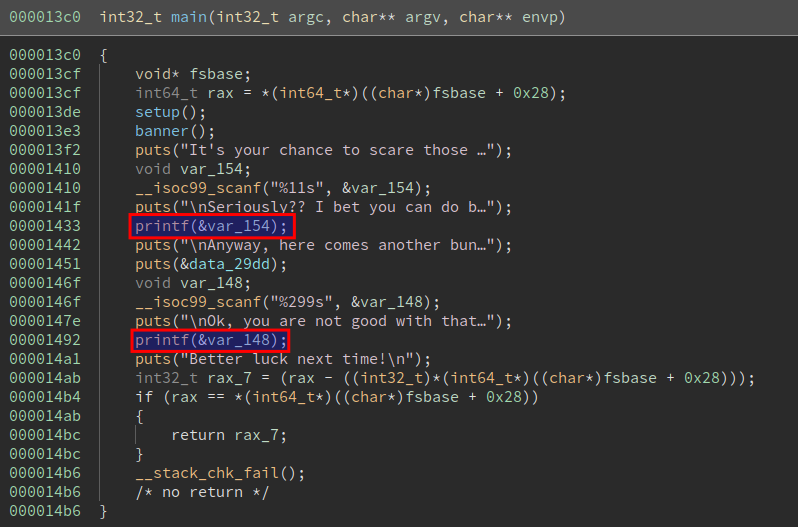

# Spooky Time

We faced an ELF 64-bit file: 

```bash
$ file spooky_time 
spooky_time: ELF 64-bit LSB pie executable, x86-64, version 1 (SYSV), dynamically linked, interpreter ./glibc/ld-linux-x86-64.so.2, BuildID[sha1]=29a41183e07159f8444eb964aae5ea33d743a20d, for GNU/Linux 3.2.0, not stripped
```

We can identify two vulnerabilites: 



There is two format string bug vulnerabilities.

For the first printf at 0x00001433, the buffer can only contains 11 bytes (according to the scanf format %11s)
That means that we cannot write with this one, but it will allow us to leak two offsets :)

## Analyse the stack

First, we analyse the stack while break at the first printf call and identify two interresting things:

```bash
0344| 0x7fffffffdf58 --> 0x7ffff7dbcd90 (<__libc_start_call_main+128>:	mov    edi,eax)
0352| 0x7fffffffdf60 --> 0x0 
0360| 0x7fffffffdf68 --> 0x5555555553c0 (<main>:	endbr64)
0368| 0x7fffffffdf70 --> 0x100000000 
```
 So we can leak a libc address to calculate system or whatever, thus defeating ASLR.
 We can also get the main addresses, thus defeating PIE.

 Well, what can we do now ?

 ## Smash the stack

 First, I thougth about too complicatede scenarios like leak the canary, loop back into main, modify scanf formater to create some buffer overflow .... no way

 ### One gadget to rule them all

 Libc was given for this chall and have three magic gadgets:

 ```bash
 $ one_gadget libc.so.6 
0x50a37 posix_spawn(rsp+0x1c, "/bin/sh", 0, rbp, rsp+0x60, environ)
constraints:
  rsp & 0xf == 0
  rcx == NULL
  rbp == NULL || (u16)[rbp] == NULL

0xebcf1 execve("/bin/sh", r10, [rbp-0x70])
constraints:
  address rbp-0x78 is writable
  [r10] == NULL || r10 == NULL
  [[rbp-0x70]] == NULL || [rbp-0x70] == NULL

0xebcf5 execve("/bin/sh", r10, rdx)
constraints:
  address rbp-0x78 is writable
  [r10] == NULL || r10 == NULL
  [rdx] == NULL || rdx == NULL

0xebcf8 execve("/bin/sh", rsi, rdx)
constraints:
  address rbp-0x78 is writable
  [rsi] == NULL || rsi == NULL
```

The strategy is the following:
 - Leak libc address to calculate one_gadget
 - Leak programm address to calculate program base, then some GOT
 - Overwrite GOT with one gadget
 - Grab flag

The script is the real script that was used during the CTF, because it's boring to see scripts modified after CTF end :D
And I'm too lazy to re-write it ^^'
