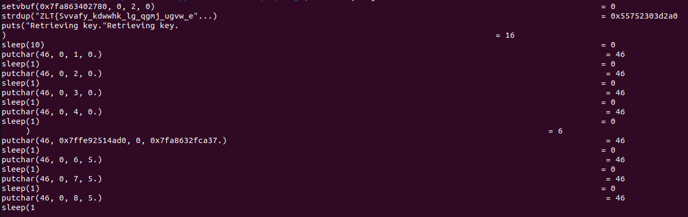
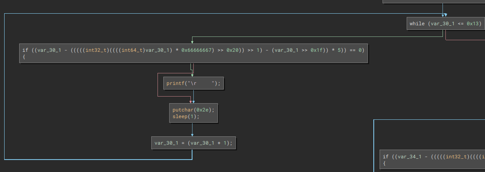
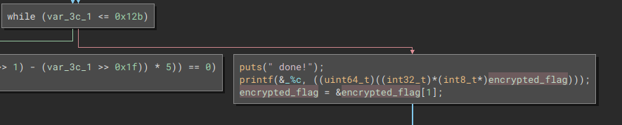
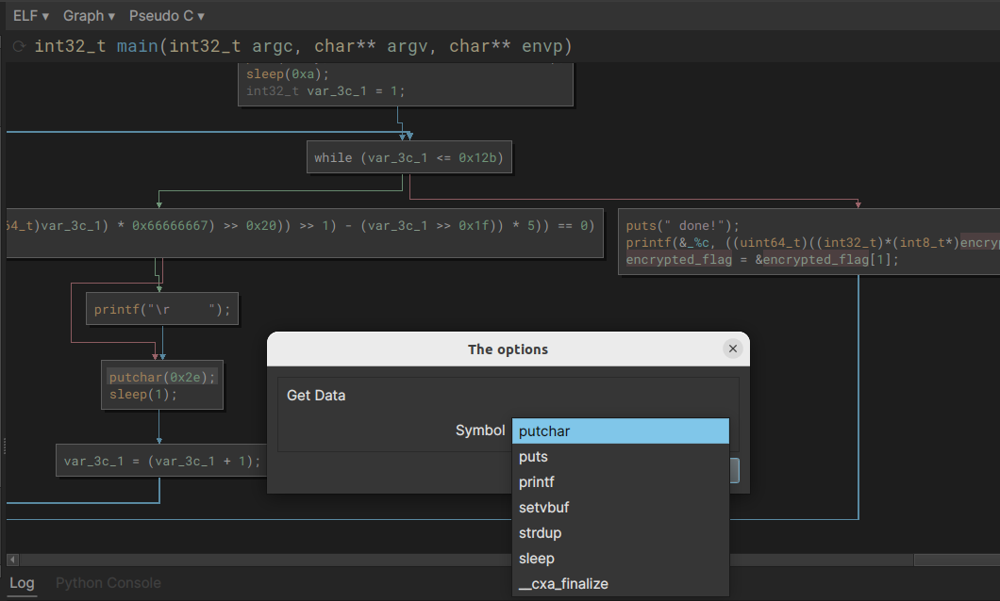
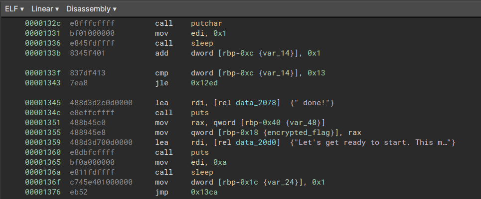
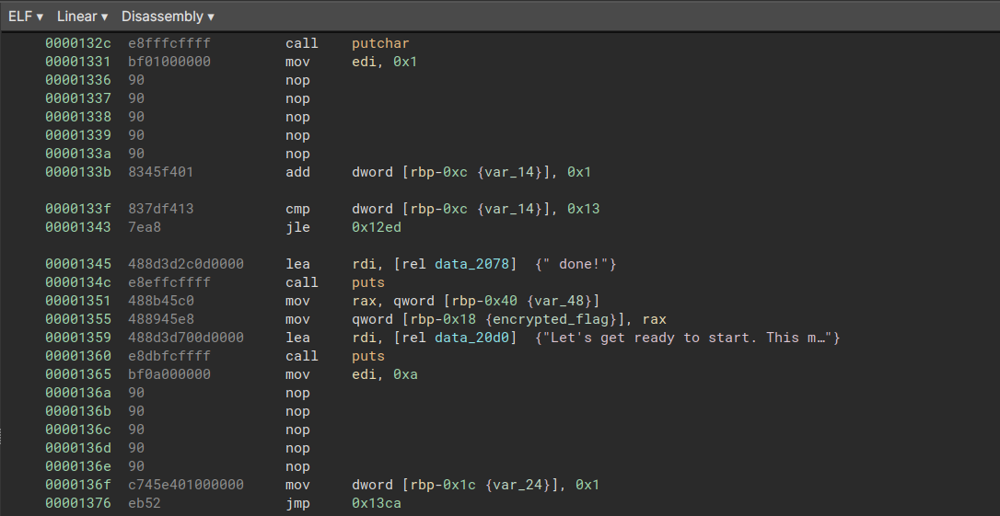

# Ouija

Challenge is composed of the following file:

```bash
$ file ouija 
ouija: ELF 64-bit LSB pie executable, x86-64, version 1 (SYSV), dynamically linked, interpreter /lib64/ld-linux-x86-64.so.2, BuildID[sha1]=2cace162c306a34dcfc4837d648d047e2ea339fe, for GNU/Linux 3.2.0, not stripped
```

At runtime, it seems to be a full sleep(3) binary computing the flag...



Let's inspect it with Binary Ninja :)

We can quickly identify some patterns similar to this one: 



After a lot of this pattern instructions, we can see a printf of one flag character: 



To sum up, the binary just does some long sleeps, then compute a key to "decrypt" the flag. At this time, several way to solve this chall came in mind: 

 - Hook sleep with LD_PRELOAD trick (too easy =p)
 - Patch all sleep call in the binary (hmmm :D)
 - Reverse the main function and decrytp the flag (na)

I always wanted to learn how to write Binary Ninja Plugin so ... I wrote one to patch as NOP choosen symbols ^^

Say hello to [Nopify](https://github.com/9hozt/nopify) Repo is temporarily not available

So using this plugin, i'm able to "patch as NOP" some chossen symbols. As the binary use the printf(3) function to prinf the flag character, I just patched all other 'print' functions, as well as sleep calls of course.





Running the patched binary with some bash magic gives the flag: 

```bash
$ ./ouija_patched |tr -d ' \r\n'
HTB{Adding_sleeps_to_your_code_makes_it_easy_to_optimize_later!}
```
