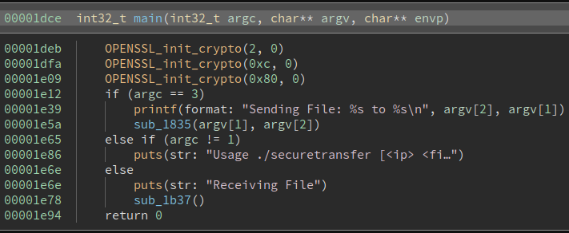
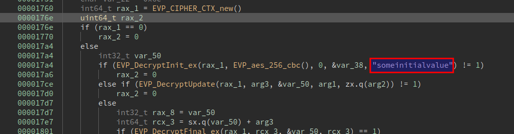
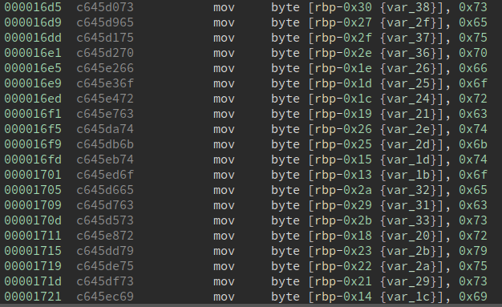
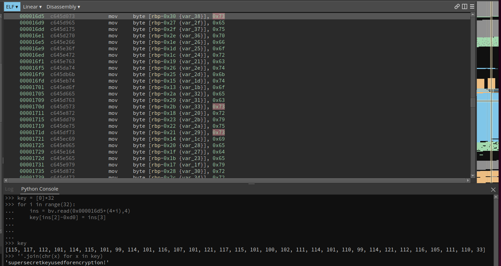

# Secure Transfer

Challenge is composed of two files:

```bash
$ file securetransfer 
securetransfer: ELF 64-bit LSB pie executable, x86-64, version 1 (SYSV), dynamically linked, interpreter /lib64/ld-linux-x86-64.so.2, BuildID[sha1]=0457997eda987eb100de85a2954fc8b8fc660a53, for GNU/Linux 3.2.0, stripped
$ file trace.pcap 
trace.pcap: pcap capture file, microsecond ts (little-endian) - version 2.4 (Ethernet, capture length 65535)
```

The trace.pcap file contains some tcp frames: 

```bash
$ tshark -r trace.pcap 
    1   0.000000   10.13.32.2 → 10.13.32.3   TCP 74 38942 → 1337 [SYN] Seq=0 Win=64240 Len=0 MSS=1460 SACK_PERM=1 TSval=1332653230 TSecr=0 WS=128
    2   0.000046   10.13.32.3 → 10.13.32.2   TCP 74 1337 → 38942 [SYN, ACK] Seq=0 Ack=1 Win=65160 Len=0 MSS=1460 SACK_PERM=1 TSval=3766005229 TSecr=1332653230 WS=128
    3   0.001343   10.13.32.2 → 10.13.32.3   TCP 66 38942 → 1337 [ACK] Seq=1 Ack=1 Win=64256 Len=0 TSval=1332653234 TSecr=3766005229
    4   0.001453   10.13.32.2 → 10.13.32.3   TCP 74 38942 → 1337 [PSH, ACK] Seq=1 Ack=1 Win=64256 Len=8 TSval=1332653234 TSecr=3766005229
    5   0.001453   10.13.32.2 → 10.13.32.3   TCP 98 38942 → 1337 [FIN, PSH, ACK] Seq=9 Ack=1 Win=64256 Len=32 TSval=1332653234 TSecr=3766005229
    6   0.001469   10.13.32.3 → 10.13.32.2   TCP 66 1337 → 38942 [ACK] Seq=1 Ack=9 Win=65152 Len=0 TSval=3766005230 TSecr=1332653234
    7   0.001952   10.13.32.3 → 10.13.32.2   TCP 66 1337 → 38942 [FIN, ACK] Seq=1 Ack=42 Win=65152 Len=0 TSval=3766005231 TSecr=1332653234
    8   0.002164   10.13.32.2 → 10.13.32.3   TCP 66 38942 → 1337 [ACK] Seq=42 Ack=2 Win=64256 Len=0 TSval=1332653234 TSecr=3766005231
```

Let's move to the interresting part :)



We can see some crypto coming..

We quickly identify the decrypt routine, AES256 CBC is used, containg the IV and the key. The key is "scrambled" : 




We can recompose the key using some python magic: 



Now we just have to extract data from the pcap and decrypt it :)

```bash
$ tshark -2 -r trace.pcap -R "ip.dst == 10.13.32.3" -T fields -e tcp.payload
2000000000000000
5f558867993dccc99879f7ca39c5e406972f84a3a9dd5d48972421ff375cb18c
```
