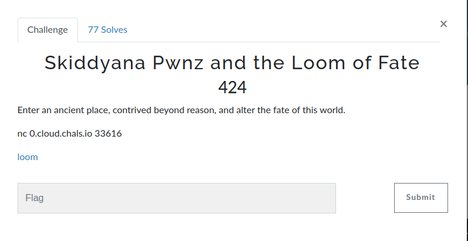
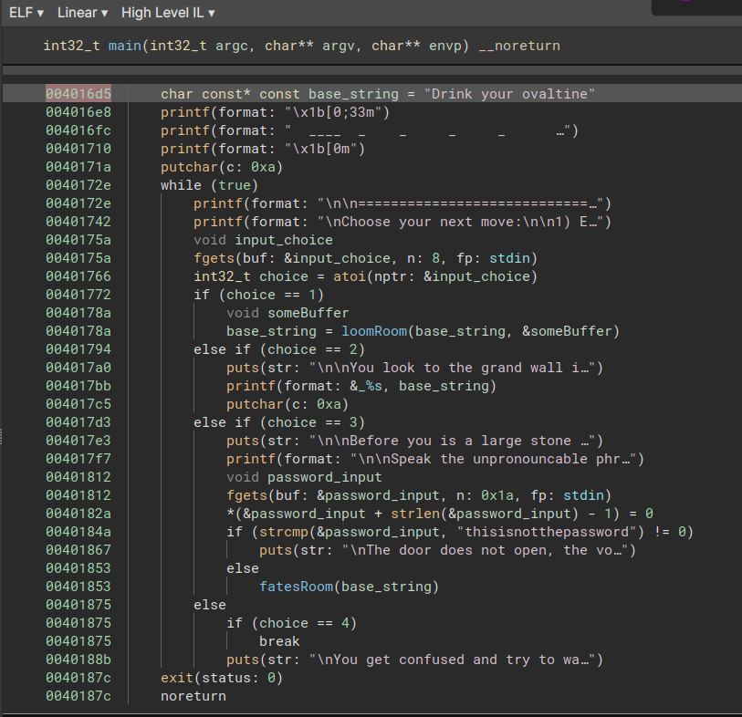
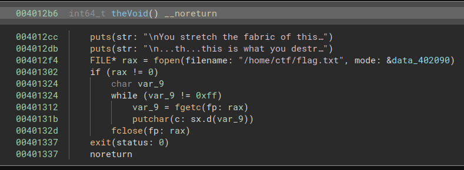
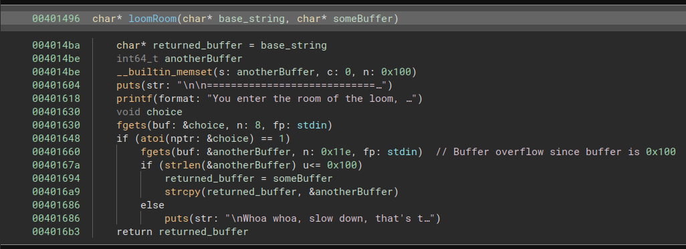

# Loom



Challenge consits in a remote pwnable, binary is provided:

```bash
$ file loom
loom: ELF 64-bit LSB executable, x86-64, version 1 (SYSV), dynamically linked, interpreter /lib64/ld-linux-x86-64.so.2, BuildID[sha1]=3b2e5cfecf4e1b5fb5a13f6383940cccf2a44ff4, for GNU/Linux 3.2.0, not stripped
```
The binary presents various menus:

```
1) Enter the room of the loom
2) Read the wall of prophecy
3) Enter the room of the fates
4) leave
```

Let's dissassemble :)

The main function is quiet simple, just provinding some menus, and printing constant strings.


The 3rd choice ask for an hardcoded password "thisisnotthepassword", we can reasonably guess that this value is retacted and is not valid remotly.

We can identify a win function that will display the flag:


An unsafe strcpy call is performed in the loomRoom function:


Thanks to this, we can overwrite the buffer address, and then call the 2nd menu choice to print whatever we want, the password for example :D

Once we get the password, we can trigger this overflow one more time to call the win function.


```bash
(pwnage) ghozt@maze:~/CTF/ctf-write-up/2023-tenable/pwn/loom$ python3 solve.py
[+] Opening connection to 0.cloud.chals.io on port 33616: Done
[*] Switching to interactive mode

You stretch the fabric of this reality, its premise worn thin.

...th...this is what you destroyed reality for?
Ok. Well. It's yours.

flag{d0nt_f0rg3t_y0ur_h4t}
[*] Got EOF while reading in interactive
```
