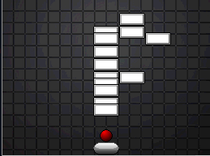

# BrickBreaker

## The challenge


This is a reverse engineering challenge involving a Nintendo DS ROM.

```bash
$ file ctf.nds 
ctf.nds: Nintendo DS Slot-2 ROM image (PassMe)
```

Using [DeSmuME](https://github.com/TASEmulators/desmume), the ROM can be emulated:


The game is a very hard uncontrollable brick breaker game. You have only 5 lives and, at first sight, the number of level is unknown.
After a loose, the final score is printed on the screen. I succed in passing level 1 and 2 manually and did not spot any flag clues.
My first thought was that each level provid a flag character, but not seeing anythink while winning levels, I tought about a specific score to get the flag, or just win last level...

Let reverse this to confirm or deny these toughts. I never reversed this file format so RTFM is needed :D

## Reversing and debugging to madness

This [great documentation](https://www.chibialiens.com/arm/nds.php) was used.

According to this, we are able to retrieve the armv9 entrypoint and base image offset address:


Using my favorite disassembler [Binary Ninja](https://binary.ninja/) the rom can be properlly mapped to the extracted address and offset.


Once analyse is done, we can identify interresting strings with cool code reference:


Thanks to this references, a very inetressting function appears:


This seems to be responsible of the main game loop. Something is happening at level 4, intuitively, I would say that when level 4 is complete, it brings you back to level 1... not so fair :D

At this points, two possibilities comes to me:
 - Keep reversing statically
 - Use Desmume debugger alongside gdb-multiarch
 
 First, I used gdb to overwrite the current level variable (at 0x02060dba) to go to last one, but no flag... I also tried to modify the lives amount (at 0x02060db8) and play levels but still no flag..
 
 ##  Step back and think out the box
 
 Well after a lot of hours digging the code, nothing more was found, no flag computation or character print on screen. I decided to move back and think differently, and the magic happens :D
 
 While on the game screen, I figured out that the brick layer seems to be letters... letters of the flag !
 
 
 
 
 
 So, each level bricks position represent a flag character ><
 
 Now it is possible to load each level one by one and not down the flag, this can be done using the debugger. But I like static reversing :D so I decide to do it this way.
 
 Using Binary Ninja API, we can extract all bricks positions for each level and create a quick and dirty image from these data.
 I first define the list of all setuplevelX functions in the proper order:
 
 ```python
 func_list = [0x020025b4, 0x02008da0, 0x02008764,0x020080e4, 0x02007b14, 0x020074ac, 0x02006edc,0x020068b4, 0x0200626c, 0x02005c30, 0x0200554c, 0x02004f18, 0x020048fc, 0x02004338, 0x02003d94, 0x020037b4, 0x02003200]
 ```
 
 Then, I use the Binary Ninja API to get all call to "loadSprite" where "type" is 3 (brickSprite), then I create a nested list with positions of bricks for each level:
 
 ```python
 >>> fullpos=[]
 >>> for f_addr in func_list:
 ... 	pos = []
 ... 	calls = bv.get_function_at(f_addr).call_sites     # This get all functions called in the targeted function
 ... 	for i in calls:
 ... 		if i.llil.operands[0].value.value == 0x2001a90:  # if called func address is 0x2001a90 (loadSprite)
 ... 			if i.hlil.operands[1][0].value.value == 3:      # 3 is brickSprite
 ... 				x = i.hlil.operands[1][3].value.value          # X coordinate
 ... 				y = i.hlil.operands[1][4].value.value          # Y coordinate
 ... 				pos.append([x,y])
 ... 	fullpos.append(pos)
 >>> len(fullpos)
 17
 ```
 
 That sounds good :) Now, let's use PIL to create images:
 
 ```python
 >>> for i in fullpos:
 ... 	img = Image.new( 'RGB', (255,255), "white")
 ... 	for current in i:
 ... 		for z in range(10):
 ... 			img.putpixel( (current[0]+z, current[1]+z), (0, 0, 0, 123) )
 ... 	img.save("/tmp/flag/"+str(ctr)+".bmp")
 ... 	ctr +=1
 ```
 
 Then we can read the flag !
 
 
 
 Created images are in ```flag_img``` directory

 ```
 flag{Br3Ak0U7!!1}
 ```
 Cannot validate the flag since I solved it after the CTF end :D